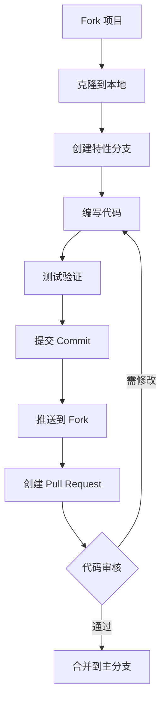

<div align="center">


# 📝 论文格

### **毕业论文格式一键排版工具**

*让论文格式规范变简单 · 让毕业更轻松*

[](https://www.python.org/downloads/)
[](https://flask.palletsprojects.com/)
[](LICENSE)
[](https://github.com/1822520752/paper-format/stargazers)
[](https://github.com/1822520752/paper-format/issues)
[](https://github.com/1822520752/paper-format/network/members)


**[🚀 在线体验](https://paperformat-zx1822520752.app.haisnap.com/) · [📖 使用文档](#使用指南) · [🐛 反馈问题](https://github.com/1822520752/paper-format/issues) · [💡 功能建议](https://github.com/1822520752/paper-format/issues)**

</div>

---

## 📑 目录

- [📖 项目背景](#-项目背景)
- [✨ 核心功能](#-核心功能)
- [🎮 功能演示](#-功能演示)
- [🚀 快速开始](#-快速开始)
- [📋 使用指南](#-使用指南)
- [⚙️ 配置详解](#️-配置详解)
- [📁 项目结构](#-项目结构)
- [🔌 API 文档](#-api-文档)
- [🏗️ 技术架构](#️-技术架构)
- [🤝 参与贡献](#-参与贡献)
- [❓ 常见问题](#-常见问题)
- [📜 更新日志](#-更新日志)
- [📄 开源协议](#-开源协议)
- [👤 关于作者](#-关于作者)

---

## 📖 项目背景

### 为什么开发这个工具？

每到毕业季，无数高校毕业生都要面对繁琐的论文格式调整工作：

> 😫 "页边距要调，字体要改，行距要设置……"
> 
> 😫 "参考文献格式又不对，图表标题位置不对……"
> 
> 😫 "改了半天还是不符合学校要求……"

**论文格** 就是为了解决这些痛点而生！

### 我们的目标

- ✅ **解放双手** - 告别繁琐的手动格式调整
- ✅ **提高效率** - 一键完成格式检查与排版
- ✅ **规范统一** - 严格遵循国标 GB/T 7713.1-2006
- ✅ **简单易用** - 无需安装，网页端即可使用

---

## ✨ 核心功能

### 🔍 智能格式检查

| 检查项目 | 检查内容 | 检测精度 |
|:---:|:---|:---:|
| 📄 **页面设置** | 上/下/左/右页边距、纸张大小 | 0.1cm |
| 🔤 **标题格式** | 一级/二级/三级标题字体、字号、加粗、对齐 | 精确 |
| 📝 **正文格式** | 正文字体、字号、行距、首行缩进 | 精确 |
| 📋 **摘要格式** | 中英文摘要标题、正文格式 | 精确 |
| 🖼️ **图表标题** | 图题、表题字体、字号、位置 | 精确 |
| 📚 **参考文献** | 参考文献标题、正文格式 | 精确 |
| 📑 **页眉页脚** | 页眉内容、页码格式 | 精确 |

### 🎨 一键智能排版

| 功能 | 描述 |
|:---:|:---|
| 🎯 **自动识别** | 智能识别标题、正文、摘要等不同内容 |
| ⚡ **批量处理** | 一次性完成所有格式调整 |
| 🔧 **自定义配置** | 支持自定义格式参数 |
| 📥 **保留内容** | 排版过程不改变原文内容 |
| 💾 **即时下载** | 排版完成即可下载 |

### 📋 预设模板

| 模板名称 | 适用场景 | 页边距 | 行距 | 正文字体 | 特点 |
|:---:|:---|:---:|:---:|:---:|:---|
| 🎓 **国标通用** | 大多数高校 | 2.5/2.5/3.0/2.5 | 1.5倍 | 宋体 | 标准国标格式 |
| 🔬 **理工科论文** | 理工科专业 | 2.5/2.5/2.5/2.5 | 1.25倍 | 宋体 | 紧凑排版，适合公式图表 |
| 📚 **文科论文** | 文科类专业 | 2.5/2.5/3.0/2.5 | 2.0倍 | 仿宋 | 宽松排版，适合文字论述 |

---

## 🎮 功能演示

### 使用流程

```
┌─────────────┐    ┌─────────────┐    ┌─────────────┐    ┌─────────────┐
│   📤 上传   │ ─► │   🔍 检查   │ ─► │   ✨ 排版   │ ─► │   📥 下载   │
│   Word文档  │    │   格式问题  │    │   一键修正  │    │   规范文档  │
└─────────────┘    └─────────────┘    └─────────────┘    └─────────────┘
```

### 检查报告示例

```json
{
  "total_items": 25,
  "passed_items": 18,
  "failed_items": 7,
  "pass_rate": 72.0,
  "items": [
    {
      "category": "页面设置",
      "name": "上页边距",
      "passed": false,
      "current": "2.0cm",
      "expected": "2.5cm",
      "suggestion": "将上页边距调整为2.5cm"
    }
    // ... 更多检查项
  ]
}
```

---

## 🚀 快速开始

### 环境要求

| 环境 | 版本要求 | 说明 |
|:---:|:---:|:---|
| Python | 3.8+ | 推荐 3.10 或 3.11 |
| pip | 最新版 | Python 包管理器 |
| 操作系统 | Windows/macOS/Linux | 跨平台支持 |

### 安装步骤

#### 方式一：从 GitHub 克隆（推荐）

```bash
# 1. 克隆项目
git clone https://github.com/1822520752/paper-format.git

# 2. 进入项目目录
cd paper-format/backend

# 3. 创建虚拟环境（可选但推荐）
python -m venv venv

# 4. 激活虚拟环境
# Windows:
venv\Scripts\activate
# macOS/Linux:
source venv/bin/activate

# 5. 安装依赖
pip install -r requirements.txt

# 6. 启动服务
python app.py
```

#### 方式二：下载 ZIP

```bash
# 1. 下载并解压项目
# 2. 进入 backend 目录
# 3. pip install -r requirements.txt
# 4. python app.py
```

### 启动服务

```bash
python app.py
```

看到以下输出表示启动成功：

```
INFO:__main__:启动服务器在端口 3000
 * Serving Flask app 'app'
 * Running on http://0.0.0.0:3000/ (Press CTRL+C to quit)
```

### 访问应用

打开浏览器访问：**http://localhost:3000**

---

## 📋 使用指南

### 步骤一：上传文档

1. 点击「选择文件」按钮
2. 选择需要处理的 Word 文档（.docx 格式）
3. 点击「上传」按钮
4. 等待上传完成

> ⚠️ **注意**：仅支持 .docx 格式，不支持 .doc 格式

### 步骤二：检查格式

1. 文档上传成功后，点击「格式检查」按钮
2. 系统将自动检测文档格式
3. 查看检查报告，了解格式问题

### 步骤三：一键排版

1. 确认格式配置（可使用默认或自定义）
2. 点击「一键排版」按钮
3. 等待排版完成

### 步骤四：下载文档

1. 排版完成后点击「下载」按钮
2. 获取格式规范的文档

---

## ⚙️ 配置详解

### 完整配置项

```json
{
  "page_settings": {
    "top_margin": 2.5,
    "bottom_margin": 2.5,
    "left_margin": 3.0,
    "right_margin": 2.5,
    "paper_size": "A4"
  },
  "fonts": {
    "chinese_font": "宋体",
    "english_font": "Times New Roman",
    "title_chinese_font": "黑体",
    "title_english_font": "Times New Roman"
  },
  "heading1": {
    "font_name": "黑体",
    "font_size": 16,
    "bold": true,
    "alignment": "center",
    "space_before": 1,
    "space_after": 1
  },
  "heading2": {
    "font_name": "黑体",
    "font_size": 14,
    "bold": true,
    "alignment": "left",
    "space_before": 0.5,
    "space_after": 0
  },
  "heading3": {
    "font_name": "黑体",
    "font_size": 12,
    "bold": true,
    "alignment": "left",
    "space_before": 0,
    "space_after": 0
  },
  "body": {
    "font_name": "宋体",
    "font_size": 12,
    "line_spacing": 1.5,
    "line_spacing_type": "multiple",
    "first_line_indent": 2
  },
  "figure_caption": {
    "font_name": "宋体",
    "font_size": 10.5,
    "alignment": "center"
  },
  "header": {
    "font_name": "宋体",
    "font_size": 9,
    "alignment": "center",
    "content": ""
  },
  "footer": {
    "alignment": "center",
    "page_number_format": "arabic"
  },
  "reference": {
    "title_font_name": "黑体",
    "title_font_size": 16,
    "body_font_name": "宋体",
    "body_font_size": 10.5,
    "number_format": "[{}]"
  }
}
```

### 配置项说明

#### 页面设置 (page_settings)

| 参数 | 类型 | 默认值 | 说明 |
|:---|:---:|:---:|:---|
| top_margin | float | 2.5 | 上页边距 (cm) |
| bottom_margin | float | 2.5 | 下页边距 (cm) |
| left_margin | float | 3.0 | 左页边距 (cm) |
| right_margin | float | 2.5 | 右页边距 (cm) |
| paper_size | string | "A4" | 纸张大小 |

#### 标题设置 (heading1/2/3)

| 参数 | 类型 | 默认值 | 说明 |
|:---|:---:|:---:|:---|
| font_name | string | "黑体" | 字体名称 |
| font_size | int | 16/14/12 | 字号 (pt) |
| bold | bool | true | 是否加粗 |
| alignment | string | "center"/"left" | 对齐方式 |
| space_before | float | 1 | 段前间距 (行) |
| space_after | float | 1 | 段后间距 (行) |

#### 正文设置 (body)

| 参数 | 类型 | 默认值 | 说明 |
|:---|:---:|:---:|:---|
| font_name | string | "宋体" | 字体名称 |
| font_size | int | 12 | 字号 (pt) |
| line_spacing | float | 1.5 | 行距倍数 |
| line_spacing_type | string | "multiple" | 行距类型 |
| first_line_indent | int | 2 | 首行缩进 (字符) |

---

## 📁 项目结构

```
paper-format/
│
├── 📂 backend/                      # 后端服务
│   ├── 📄 app.py                   # Flask 主应用入口
│   ├── 📄 requirements.txt         # Python 依赖列表
│   │
│   ├── 📂 utils/                   # 核心工具模块
│   │   ├── 📄 docx_processor.py   # Word 文档处理核心类
│   │   │                          # - 文档加载与解析
│   │   │                          # - 格式检查逻辑
│   │   │                          # - 格式排版逻辑
│   │   │
│   │   └── 📄 format_config.py    # 格式配置管理
│   │                              # - 默认配置定义
│   │                              # - 配置合并验证
│   │                              # - 模板管理
│   │
│   └── 📂 temp_uploads/            # 临时文件存储目录
│       └── (上传的文档临时存储)
│
├── 📂 frontend/                    # 前端界面
│   └── 📂 public/
│       ├── 📄 index.html           # 主页面 HTML
│       │
│       ├── 📂 css/
│       │   └── 📄 style.css       # 样式文件
│       │
│       └── 📂 js/
│           └── 📄 app.js          # 前端交互逻辑
│
├── 📄 README.md                    # 项目说明文档
├── 📄 LICENSE                      # MIT 开源协议
├── 📄 .gitignore                   # Git 忽略配置
└── 📄 install.sh                   # Linux 安装脚本
```

---

## 🔌 API 文档

### 基础信息

- **Base URL**: `http://localhost:3000`
- **Content-Type**: `application/json`
- **响应格式**: JSON

### 接口列表

#### 1. 上传文档

```http
POST /api/upload
Content-Type: multipart/form-data
```

**请求参数**

| 参数 | 类型 | 必填 | 说明 |
|:---|:---:|:---:|:---|
| file | File | ✅ | Word 文档文件 (.docx) |

**响应示例**

```json
{
  "file_id": "a1b2c3d4-e5f6-7890-abcd-ef1234567890",
  "filename": "毕业论文.docx",
  "size": 102400
}
```

---

#### 2. 格式检查

```http
POST /api/check
Content-Type: application/json
```

**请求参数**

| 参数 | 类型 | 必填 | 说明 |
|:---|:---:|:---:|:---|
| file_id | string | ✅ | 上传返回的文件ID |
| format_config | object | ❌ | 自定义格式配置 |

**响应示例**

```json
{
  "total_items": 25,
  "passed_items": 18,
  "failed_items": 7,
  "pass_rate": 72.0,
  "items": [...]
}
```

---

#### 3. 一键排版

```http
POST /api/format
Content-Type: application/json
```

**请求参数**

| 参数 | 类型 | 必填 | 说明 |
|:---|:---:|:---:|:---|
| file_id | string | ✅ | 上传返回的文件ID |
| format_config | object | ❌ | 自定义格式配置 |

**响应示例**

```json
{
  "formatted_file_id": "b2c3d4e5-f6a7-8901-bcde-f12345678901",
  "filename": "毕业论文_已排版.docx",
  "message": "排版完成"
}
```

---

#### 4. 下载文档

```http
GET /api/download/{file_id}
```

**路径参数**

| 参数 | 类型 | 说明 |
|:---|:---:|:---|
| file_id | string | 文件ID |

**响应**: 文件下载流

---

#### 5. 获取模板列表

```http
GET /api/templates
```

**响应示例**

```json
{
  "templates": [
    {
      "name": "国标通用",
      "description": "国标通用格式模板",
      "config": {...}
    }
  ],
  "default": "国标通用"
}
```

---

## 🏗️ 技术架构

### 技术栈

| 层级 | 技术 | 说明 |
|:---:|:---|:---|
| 前端 | HTML5 + CSS3 + JavaScript | 原生实现，无框架依赖 |
| 后端 | Flask 2.0+ | Python 轻量级 Web 框架 |
| 文档处理 | python-docx | Word 文档读写库 |
| 跨域 | Flask-CORS | 跨域资源共享支持 |

### 系统架构图

```
┌─────────────────────────────────────────────────────────────────┐
│                         用户界面层                               │
│  ┌─────────────┐  ┌─────────────┐  ┌─────────────┐             │
│  │  文件上传   │  │  格式检查   │  │  一键排版   │             │
│  └─────────────┘  └─────────────┘  └─────────────┘             │
└─────────────────────────────────────────────────────────────────┘
                              │
                              ▼
┌─────────────────────────────────────────────────────────────────┐
│                         API 服务层                               │
│  ┌─────────────────────────────────────────────────────────┐   │
│  │                    Flask Application                     │   │
│  │  /api/upload  │  /api/check  │  /api/format  │  ...     │   │
│  └─────────────────────────────────────────────────────────┘   │
└─────────────────────────────────────────────────────────────────┘
                              │
                              ▼
┌─────────────────────────────────────────────────────────────────┐
│                         业务逻辑层                               │
│  ┌─────────────────────┐  ┌─────────────────────┐              │
│  │   DocxProcessor     │  │   FormatConfig      │              │
│  │   - 文档解析        │  │   - 配置管理        │              │
│  │   - 格式检查        │  │   - 模板管理        │              │
│  │   - 格式排版        │  │   - 参数验证        │              │
│  └─────────────────────┘  └─────────────────────┘              │
└─────────────────────────────────────────────────────────────────┘
                              │
                              ▼
┌─────────────────────────────────────────────────────────────────┐
│                         数据存储层                               │
│  ┌─────────────────────────────────────────────────────────┐   │
│  │                   temp_uploads/                          │   │
│  │              (临时文件存储，自动清理)                      │   │
│  └─────────────────────────────────────────────────────────┘   │
└─────────────────────────────────────────────────────────────────┘
```

---

## 🤝 参与贡献

我们欢迎所有形式的贡献！

### 贡献方式

- 🐛 **提交 Bug** - 发现问题请提交 [Issue](https://github.com/1822520752/paper-format/issues)
- 💡 **功能建议** - 有好想法请提交 [Issue](https://github.com/1822520752/paper-format/issues)
- 📝 **完善文档** - 帮助完善 README 和代码注释
- 🔧 **提交代码** - 修复 Bug 或添加新功能

### 贡献流程



### 代码规范

- Python 代码遵循 PEP 8 规范
- 提交信息格式：`type: description`
  - `feat:` 新功能
  - `fix:` 修复 Bug
  - `docs:` 文档更新
  - `style:` 代码格式
  - `refactor:` 重构

---

## ❓ 常见问题

<details>
<summary><b>Q1: 支持哪些文档格式？</b></summary>

目前仅支持 **.docx** 格式（Office 2007+），不支持 .doc 格式。

如果你的文档是 .doc 格式，请先用 Word 或 WPS 另存为 .docx 格式。

</details>

<details>
<summary><b>Q2: 上传的文档会被保存吗？</b></summary>

**不会**。文档仅临时存储在服务器，1小时后自动删除。我们不会收集或存储你的论文内容。

</details>

<details>
<summary><b>Q3: 排版后会改变论文内容吗？</b></summary>

**不会**。排版仅调整格式（字体、字号、边距等），不会修改论文的文字内容。

</details>

<details>
<summary><b>Q4: 支持哪些论文格式标准？</b></summary>

目前支持：
- 国标 GB/T 7713.1-2006《学位论文编写规则》
- 各高校自定义格式（通过配置实现）

</details>

<details>
<summary><b>Q5: 文件大小有限制吗？</b></summary>

单个文件最大支持 **20MB**，对于普通论文文档已足够。

</details>

<details>
<summary><b>Q6: 如何自定义格式配置？</b></summary>

可以通过以下方式：
1. 在界面上选择预设模板
2. 通过 API 传入自定义配置 JSON
3. 修改 `format_config.py` 中的默认配置

</details>

<details>
<summary><b>Q7: 为什么检查结果不准确？</b></summary>

可能原因：
- 文档使用了特殊格式或样式
- 文档包含复杂的表格/公式
- 字体名称与实际不符

建议：使用标准 Word 格式编写论文，避免复杂的自定义样式。

</details>

---

## 📜 更新日志

### v1.0.0 (2026-02-28)

**🎉 首次发布**

- ✨ 支持格式检查功能
- ✨ 支持一键排版功能
- ✨ 支持预设模板
- ✨ 支持自定义配置
- 📝 完善项目文档

---

## 📄 开源协议

本项目基于 **[MIT License](LICENSE)** 开源协议。

```
MIT License

Copyright (c) 2026 试界 TryWorld

Permission is hereby granted, free of charge, to any person obtaining a copy
of this software and associated documentation files (the "Software"), to deal
in the Software without restriction, including without limitation the rights
to use, copy, modify, merge, publish, distribute, sublicense, and/or sell
copies of the Software, and to permit persons to whom the Software is
furnished to do so, subject to the following conditions:

The above copyright notice and this permission notice shall be included in all
copies or substantial portions of the Software.
```

---

## 👤 关于作者

<div align="center">


**探索无限可能**

[](https://github.com/1822520752)
[](mailto:1822520752@qq.com)

</div>

---

<div align="center">

## ⭐ 支持项目

如果这个项目对你有帮助，请给一个 **Star** ⭐

这对我非常重要，感谢支持！

[](https://star-history.com/#1822520752/paper-format&Date)

---


**© 2026 论文格 - 让论文格式规范变简单**

**By 试界 TryWorld**

</div>
