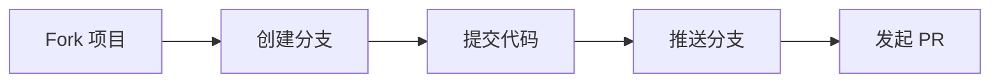

<div align="center">

# 📝 论文格

**毕业论文格式一键排版工具**

*让论文格式规范变简单*

[](https://www.python.org/)
[](https://flask.palletsprojects.com/)
[](LICENSE)
[](https://github.com/1822520752/paper-format)


**一键检查 · 智能排版 · 格式规范**

</div>

---

## 🎯 这是什么？

**论文格** 是一款专为 **高校毕业生** 设计的论文格式工具。

你是否为论文格式发愁？页边距、字体字号、行距缩进……格式要求繁琐复杂？

**论文格帮你一键解决！**

- 📤 上传 Word 文档
- 🔍 自动检查格式问题
- ✨ 一键排版符合国标
- 📥 下载规范文档

<br>

## ✨ 核心功能

<table>
<tr>
<td width="50%">

### 🔍 格式检查

- ✓ 页面设置（页边距、纸张）
- ✓ 标题格式（字体、字号、对齐）
- ✓ 正文格式（字体、行距、缩进）
- ✓ 摘要格式（中英文）
- ✓ 图表标题格式
- ✓ 参考文献格式

</td>
<td width="50%">

### 🎨 一键排版

- ✓ 自动应用国标格式
- ✓ 自定义格式配置
- ✓ 预设模板选择
- ✓ 批量格式修正
- ✓ 保留原文内容
- ✓ 导出规范文档

</td>
</tr>
</table>

<br>

## 📋 预设模板

| 模板 | 适用场景 | 特点 |
|:---:|:---|:---|
| 🎓 **国标通用** | 大多数高校 | 标准国标格式 |
| 🔬 **理工科论文** | 理工科专业 | 1.25倍行距，紧凑排版 |
| 📚 **文科论文** | 文科类专业 | 2倍行距，仿宋字体 |

<br>

## 🚀 快速开始

### 📦 安装

```bash
# 克隆项目
git clone https://github.com/1822520752/paper-format.git

# 进入后端目录
cd paper-format/backend

# 安装依赖
pip install -r requirements.txt
```

### 🎮 启动

```bash
python app.py
```

打开浏览器访问 **http://localhost:3000** 即可使用！

<br>

## 📁 项目结构

```
paper-format/
├── 📂 backend/              # 后端服务
│   ├── 📄 app.py           # Flask 主应用
│   ├── 📄 requirements.txt # 依赖列表
│   └── 📂 utils/           # 核心模块
│       ├── 🔧 docx_processor.py  # 文档处理器
│       └── ⚙️ format_config.py   # 格式配置
│
├── 📂 frontend/            # 前端界面
│   └── 📂 public/
│       ├── 📄 index.html   # 主页面
│       ├── 🎨 css/         # 样式
│       └── 💻 js/          # 脚本
│
├── 📄 README.md            # 说明文档
└── 📄 LICENSE              # 开源协议
```

<br>

## ⚙️ 默认格式配置

> 符合 GB/T 7713.1-2006 学位论文编写规则

| 设置项 | 默认值 | 说明 |
|:---:|:---:|:---|
| 📏 上页边距 | 2.5 cm | |
| 📏 下页边距 | 2.5 cm | |
| 📏 左页边距 | 3.0 cm | 装订需要 |
| 📏 右页边距 | 2.5 cm | |
| 🔤 正文字体 | 宋体 12pt | 小四号 |
| 🔤 一级标题 | 黑体 16pt | 三号，居中加粗 |
| 🔤 二级标题 | 黑体 14pt | 四号，左对齐加粗 |
| 🔤 三级标题 | 黑体 12pt | 小四号，左对齐加粗 |
| 📐 行距 | 1.5 倍 | |
| 📐 首行缩进 | 2 字符 | |

<br>

## � API 文档

| 端点 | 方法 | 描述 |
|:---|:---:|:---|
| `/api/upload` | `POST` | 📤 上传文档 |
| `/api/check` | `POST` | 🔍 格式检查 |
| `/api/format` | `POST` | ✨ 一键排版 |
| `/api/download/<id>` | `GET` | 📥 下载文档 |
| `/api/templates` | `GET` | 📋 获取模板列表 |

<br>

## 🤝 参与贡献

欢迎所有形式的贡献！



<details>
<summary>👉 贡献步骤</summary>

1. **Fork** 本仓库
2. 创建特性分支 (`git checkout -b feature/AmazingFeature`)
3. 提交更改 (`git commit -m 'Add AmazingFeature'`)
4. 推送分支 (`git push origin feature/AmazingFeature`)
5. 发起 **Pull Request**

</details>

<br>

## � 开源协议

本项目基于 **MIT** 协议开源 - 详见 [LICENSE](LICENSE) 文件

<br>

## 👤 关于作者

<div align="center">

**试界 TryWorld**

[](https://github.com/1822520752)

*探索无限可能*

</div>

---

<div align="center">

### ⭐ 如果这个项目对你有帮助

**请给一个 Star 支持一下！**


---

*Made with ❤️ by 试界 TryWorld*

**© 2026 论文格 - 让论文格式规范变简单**

</div>
