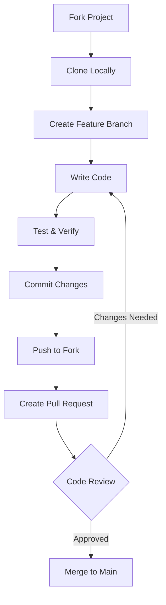

<div align="center">


# 📝 PaperFormat

### **One-Click Thesis Formatting Tool**

*Making thesis formatting simple · Making graduation easier*

[](https://www.python.org/downloads/)
[](https://flask.palletsprojects.com/)
[](LICENSE)
[](https://github.com/1822520752/paper-format/stargazers)
[](https://github.com/1822520752/paper-format/issues)
[](https://github.com/1822520752/paper-format/network/members)


**[🚀 Live Demo](https://paperformat-zx1822520752.app.haisnap.com/) · [📖 Documentation](#user-guide) · [🐛 Report Bug](https://github.com/1822520752/paper-format/issues) · [💡 Request Feature](https://github.com/1822520752/paper-format/issues)**

</div>

---

## 📑 Table of Contents

- [📖 Background](#-background)
- [✨ Core Features](#-core-features)
- [🎮 Demo](#-demo)
- [🚀 Quick Start](#-quick-start)
- [📋 User Guide](#-user-guide)
- [⚙️ Configuration](#️-configuration)
- [📁 Project Structure](#-project-structure)
- [🔌 API Documentation](#-api-documentation)
- [🏗️ Technical Architecture](#️-technical-architecture)
- [🤝 Contributing](#-contributing)
- [❓ FAQ](#-faq)
- [📜 Changelog](#-changelog)
- [📄 License](#-license)
- [👤 Author](#-author)

---

## 📖 Background

### Why This Tool?

Every graduation season, countless university graduates face the tedious task of thesis formatting:

> 😫 "Need to adjust margins, change fonts, set line spacing..."
> 
> 😫 "Reference format is wrong again, figure captions are misplaced..."
> 
> 😫 "After hours of editing, it still doesn't meet school requirements..."

**PaperFormat** was created to solve these pain points!

### Our Goals

- ✅ **Free Your Hands** - Say goodbye to tedious manual formatting
- ✅ **Improve Efficiency** - Complete format checking and formatting with one click
- ✅ **Standardization** - Strictly follow the national standard GB/T 7713.1-2006
- ✅ **Easy to Use** - No installation required, use directly in your browser

---

## ✨ Core Features

### 🔍 Smart Format Checking

| Check Item | Content | Precision |
|:---:|:---|:---:|
| 📄 **Page Settings** | Top/bottom/left/right margins, paper size | 0.1cm |
| 🔤 **Heading Format** | Level 1/2/3 heading font, size, bold, alignment | Exact |
| 📝 **Body Format** | Body font, size, line spacing, first line indent | Exact |
| 📋 **Abstract Format** | Chinese/English abstract title and body format | Exact |
| 🖼️ **Figure/Table Captions** | Caption font, size, position | Exact |
| 📚 **References** | Reference title and body format | Exact |
| 📑 **Header/Footer** | Header content, page number format | Exact |

### 🎨 One-Click Smart Formatting

| Feature | Description |
|:---:|:---|
| 🎯 **Auto Recognition** | Intelligently identify headings, body, abstract and other content |
| ⚡ **Batch Processing** | Complete all format adjustments at once |
| 🔧 **Custom Configuration** | Support custom format parameters |
| 📥 **Content Preservation** | Formatting process does not change original content |
| 💾 **Instant Download** | Download immediately after formatting |

### 📋 Preset Templates

| Template Name | Applicable Scenarios | Margins | Line Spacing | Body Font | Features |
|:---:|:---|:---:|:---:|:---:|:---|
| 🎓 **National Standard** | Most universities | 2.5/2.5/3.0/2.5 | 1.5x | SimSun | Standard format |
| 🔬 **STEM Thesis** | Science & Engineering | 2.5/2.5/2.5/2.5 | 1.25x | SimSun | Compact layout, suitable for formulas and charts |
| 📚 **Humanities Thesis** | Liberal Arts | 2.5/2.5/3.0/2.5 | 2.0x | FangSong | Loose layout, suitable for text |

---

## 🎮 Demo

### Workflow

```
┌─────────────┐    ┌─────────────┐    ┌─────────────┐    ┌─────────────┐
│   📤 Upload │ ─► │   🔍 Check  │ ─► │   ✨ Format │ ─► │   📥 Download│
│   Word Doc  │    │   Issues    │    │   One-Click │    │   Result    │
└─────────────┘    └─────────────┘    └─────────────┘    └─────────────┘
```

### Sample Check Report

```json
{
  "total_items": 25,
  "passed_items": 18,
  "failed_items": 7,
  "pass_rate": 72.0,
  "items": [
    {
      "category": "Page Settings",
      "name": "Top Margin",
      "passed": false,
      "current": "2.0cm",
      "expected": "2.5cm",
      "suggestion": "Adjust top margin to 2.5cm"
    }
    // ... more check items
  ]
}
```

---

## 🚀 Quick Start

### Requirements

| Environment | Version | Notes |
|:---:|:---:|:---|
| Python | 3.8+ | 3.10 or 3.11 recommended |
| pip | Latest | Python package manager |
| OS | Windows/macOS/Linux | Cross-platform support |

### Installation

#### Option 1: Clone from GitHub (Recommended)

```bash
# 1. Clone the project
git clone https://github.com/1822520752/paper-format.git

# 2. Navigate to project directory
cd paper-format/backend

# 3. Create virtual environment (optional but recommended)
python -m venv venv

# 4. Activate virtual environment
# Windows:
venv\Scripts\activate
# macOS/Linux:
source venv/bin/activate

# 5. Install dependencies
pip install -r requirements.txt

# 6. Start the server
python app.py
```

#### Option 2: Download ZIP

```bash
# 1. Download and extract the project
# 2. Navigate to backend directory
# 3. pip install -r requirements.txt
# 4. python app.py
```

### Start the Server

```bash
python app.py
```

You should see the following output indicating successful startup:

```
INFO:__main__:Starting server on port 3000
 * Serving Flask app 'app'
 * Running on http://0.0.0.0:3000/ (Press CTRL+C to quit)
```

### Access the Application

Open your browser and visit: **http://localhost:3000**

---

## 📋 User Guide

### Step 1: Upload Document

1. Click the "Choose File" button
2. Select the Word document to process (.docx format)
3. Click the "Upload" button
4. Wait for upload to complete

> ⚠️ **Note**: Only .docx format is supported, .doc format is not supported

### Step 2: Check Format

1. After successful upload, click the "Format Check" button
2. The system will automatically detect document format
3. Review the check report to understand format issues

### Step 3: One-Click Formatting

1. Confirm format configuration (use default or customize)
2. Click the "One-Click Format" button
3. Wait for formatting to complete

### Step 4: Download Document

1. After formatting, click the "Download" button
2. Get the formatted document

---

## ⚙️ Configuration

### Complete Configuration Options

```json
{
  "page_settings": {
    "top_margin": 2.5,
    "bottom_margin": 2.5,
    "left_margin": 3.0,
    "right_margin": 2.5,
    "paper_size": "A4"
  },
  "fonts": {
    "chinese_font": "SimSun",
    "english_font": "Times New Roman",
    "title_chinese_font": "SimHei",
    "title_english_font": "Times New Roman"
  },
  "heading1": {
    "font_name": "SimHei",
    "font_size": 16,
    "bold": true,
    "alignment": "center",
    "space_before": 1,
    "space_after": 1
  },
  "heading2": {
    "font_name": "SimHei",
    "font_size": 14,
    "bold": true,
    "alignment": "left",
    "space_before": 0.5,
    "space_after": 0
  },
  "heading3": {
    "font_name": "SimHei",
    "font_size": 12,
    "bold": true,
    "alignment": "left",
    "space_before": 0,
    "space_after": 0
  },
  "body": {
    "font_name": "SimSun",
    "font_size": 12,
    "line_spacing": 1.5,
    "line_spacing_type": "multiple",
    "first_line_indent": 2
  },
  "figure_caption": {
    "font_name": "SimSun",
    "font_size": 10.5,
    "alignment": "center"
  },
  "header": {
    "font_name": "SimSun",
    "font_size": 9,
    "alignment": "center",
    "content": ""
  },
  "footer": {
    "alignment": "center",
    "page_number_format": "arabic"
  },
  "reference": {
    "title_font_name": "SimHei",
    "title_font_size": 16,
    "body_font_name": "SimSun",
    "body_font_size": 10.5,
    "number_format": "[{}]"
  }
}
```

### Configuration Details

#### Page Settings (page_settings)

| Parameter | Type | Default | Description |
|:---|:---:|:---:|:---|
| top_margin | float | 2.5 | Top margin (cm) |
| bottom_margin | float | 2.5 | Bottom margin (cm) |
| left_margin | float | 3.0 | Left margin (cm) |
| right_margin | float | 2.5 | Right margin (cm) |
| paper_size | string | "A4" | Paper size |

#### Heading Settings (heading1/2/3)

| Parameter | Type | Default | Description |
|:---|:---:|:---:|:---|
| font_name | string | "SimHei" | Font name |
| font_size | int | 16/14/12 | Font size (pt) |
| bold | bool | true | Bold or not |
| alignment | string | "center"/"left" | Alignment |
| space_before | float | 1 | Space before paragraph (lines) |
| space_after | float | 1 | Space after paragraph (lines) |

#### Body Settings (body)

| Parameter | Type | Default | Description |
|:---|:---:|:---:|:---|
| font_name | string | "SimSun" | Font name |
| font_size | int | 12 | Font size (pt) |
| line_spacing | float | 1.5 | Line spacing multiplier |
| line_spacing_type | string | "multiple" | Line spacing type |
| first_line_indent | int | 2 | First line indent (characters) |

---

## 📁 Project Structure

```
paper-format/
│
├── 📂 backend/                      # Backend service
│   ├── 📄 app.py                   # Flask main application
│   ├── 📄 requirements.txt         # Python dependencies
│   │
│   ├── 📂 utils/                   # Core utility modules
│   │   ├── 📄 docx_processor.py   # Word document processor
│   │   │                          # - Document loading and parsing
│   │   │                          # - Format checking logic
│   │   │                          # - Format formatting logic
│   │   │
│   │   └── 📄 format_config.py    # Format configuration management
│   │                              # - Default configuration
│   │                              # - Configuration merge and validation
│   │                              # - Template management
│   │
│   └── 📂 temp_uploads/            # Temporary file storage
│       └── (Uploaded documents temporary storage)
│
├── 📂 frontend/                    # Frontend interface
│   └── 📂 public/
│       ├── 📄 index.html           # Main page HTML
│       │
│       ├── 📂 css/
│       │   └── 📄 style.css       # Stylesheet
│       │
│       └── 📂 js/
│           └── 📄 app.js          # Frontend interaction logic
│
├── 📄 README.md                    # Project documentation
├── 📄 LICENSE                      # MIT License
├── 📄 .gitignore                   # Git ignore configuration
└── 📄 install.sh                   # Linux installation script
```

---

## 🔌 API Documentation

### Basic Information

- **Base URL**: `http://localhost:3000`
- **Content-Type**: `application/json`
- **Response Format**: JSON

### API Endpoints

#### 1. Upload Document

```http
POST /api/upload
Content-Type: multipart/form-data
```

**Request Parameters**

| Parameter | Type | Required | Description |
|:---|:---:|:---:|:---|
| file | File | ✅ | Word document file (.docx) |

**Response Example**

```json
{
  "file_id": "a1b2c3d4-e5f6-7890-abcd-ef1234567890",
  "filename": "thesis.docx",
  "size": 102400
}
```

---

#### 2. Format Check

```http
POST /api/check
Content-Type: application/json
```

**Request Parameters**

| Parameter | Type | Required | Description |
|:---|:---:|:---:|:---|
| file_id | string | ✅ | File ID from upload response |
| format_config | object | ❌ | Custom format configuration |

**Response Example**

```json
{
  "total_items": 25,
  "passed_items": 18,
  "failed_items": 7,
  "pass_rate": 72.0,
  "items": [...]
}
```

---

#### 3. One-Click Formatting

```http
POST /api/format
Content-Type: application/json
```

**Request Parameters**

| Parameter | Type | Required | Description |
|:---|:---:|:---:|:---|
| file_id | string | ✅ | File ID from upload response |
| format_config | object | ❌ | Custom format configuration |

**Response Example**

```json
{
  "formatted_file_id": "b2c3d4e5-f6a7-8901-bcde-f12345678901",
  "filename": "thesis_formatted.docx",
  "message": "Formatting completed"
}
```

---

#### 4. Download Document

```http
GET /api/download/{file_id}
```

**Path Parameters**

| Parameter | Type | Description |
|:---|:---:|:---|
| file_id | string | File ID |

**Response**: File download stream

---

#### 5. Get Template List

```http
GET /api/templates
```

**Response Example**

```json
{
  "templates": [
    {
      "name": "National Standard",
      "description": "National standard format template",
      "config": {...}
    }
  ],
  "default": "National Standard"
}
```

---

## 🏗️ Technical Architecture

### Tech Stack

| Layer | Technology | Description |
|:---:|:---|:---|
| Frontend | HTML5 + CSS3 + JavaScript | Native implementation, no framework dependencies |
| Backend | Flask 2.0+ | Python lightweight web framework |
| Document Processing | python-docx | Word document read/write library |
| CORS | Flask-CORS | Cross-origin resource sharing support |

### System Architecture Diagram

```
┌─────────────────────────────────────────────────────────────────┐
│                         User Interface Layer                     │
│  ┌─────────────┐  ┌─────────────┐  ┌─────────────┐              │
│  │ File Upload │  │Format Check │  │One-Click Fmt│              │
│  └─────────────┘  └─────────────┘  └─────────────┘              │
└─────────────────────────────────────────────────────────────────┘
                              │
                              ▼
┌─────────────────────────────────────────────────────────────────┐
│                         API Service Layer                        │
│  ┌─────────────────────────────────────────────────────────┐    │
│  │                    Flask Application                     │    │
│  │  /api/upload  │  /api/check  │  /api/format  │  ...     │    │
│  └─────────────────────────────────────────────────────────┘    │
└─────────────────────────────────────────────────────────────────┘
                              │
                              ▼
┌─────────────────────────────────────────────────────────────────┐
│                       Business Logic Layer                       │
│  ┌─────────────────────┐  ┌─────────────────────┐               │
│  │   DocxProcessor     │  │   FormatConfig      │               │
│  │   - Document Parse  │  │   - Config Mgmt     │               │
│  │   - Format Check    │  │   - Template Mgmt   │               │
│  │   - Format Apply    │  │   - Param Validate  │               │
│  └─────────────────────┘  └─────────────────────┘               │
└─────────────────────────────────────────────────────────────────┘
                              │
                              ▼
┌─────────────────────────────────────────────────────────────────┐
│                        Data Storage Layer                        │
│  ┌─────────────────────────────────────────────────────────┐    │
│  │                   temp_uploads/                          │    │
│  │              (Temporary file storage, auto cleanup)      │    │
│  └─────────────────────────────────────────────────────────┘    │
└─────────────────────────────────────────────────────────────────┘
```

---

## 🤝 Contributing

We welcome all forms of contributions!

### How to Contribute

- 🐛 **Report Bugs** - Submit issues at [Issue Tracker](https://github.com/1822520752/paper-format/issues)
- 💡 **Feature Requests** - Submit ideas at [Issue Tracker](https://github.com/1822520752/paper-format/issues)
- 📝 **Improve Documentation** - Help improve README and code comments
- 🔧 **Submit Code** - Fix bugs or add new features

### Contribution Workflow


```mermaid
flowchart TD
    A[Fork Project] --> B[Clone Locally]
    B --> C[Create Feature Branch]
    C --> D[Write Code]
    D --> E[Test & Verify]
    E --> F[Commit Changes]
    F --> G[Push to Fork]
    G --> H[Create Pull Request]
    H --> I{Code Review}
    I -->|Approved| J[Merge to Main]
    I -->|Changes Needed| D
```

### Code Standards

- Python code follows PEP 8 standards
- Commit message format: `type: description`
  - `feat:` New feature
  - `fix:` Bug fix
  - `docs:` Documentation update
  - `style:` Code formatting
  - `refactor:` Code refactoring

---

## ❓ FAQ

<details>
<summary><b>Q1: What document formats are supported?</b></summary>

Currently only **.docx** format (Office 2007+) is supported. .doc format is not supported.

If your document is in .doc format, please convert it to .docx using Word or WPS first.

</details>

<details>
<summary><b>Q2: Will uploaded documents be saved?</b></summary>

**No**. Documents are only temporarily stored on the server and automatically deleted after 1 hour. We do not collect or store your thesis content.

</details>

<details>
<summary><b>Q3: Will formatting change my thesis content?</b></summary>

**No**. Formatting only adjusts the format (fonts, sizes, margins, etc.) and does not modify the text content of your thesis.

</details>

<details>
<summary><b>Q4: What thesis format standards are supported?</b></summary>

Currently supports:
- National Standard GB/T 7713.1-2006 "Rules for Writing Academic Papers"
- Custom university formats (through configuration)

</details>

<details>
<summary><b>Q5: Is there a file size limit?</b></summary>

Single file maximum **20MB**, which is sufficient for most thesis documents.

</details>

<details>
<summary><b>Q6: How to customize format configuration?</b></summary>

You can customize through:
1. Select preset templates in the interface
2. Pass custom configuration JSON via API
3. Modify default configuration in `format_config.py`

</details>

<details>
<summary><b>Q7: Why are the check results inaccurate?</b></summary>

Possible reasons:
- Document uses special formats or styles
- Document contains complex tables/formulas
- Font names don't match actual fonts

Recommendation: Write your thesis using standard Word formats, avoid complex custom styles.

</details>

---

## 📜 Changelog

### v1.0.0 (2026-02-28)

**🎉 Initial Release**

- ✨ Format checking feature
- ✨ One-click formatting feature
- ✨ Preset templates support
- ✨ Custom configuration support
- 📝 Complete project documentation

---

## 📄 License

This project is licensed under the **[MIT License](LICENSE)**.

```
MIT License

Copyright (c) 2026 TryWorld

Permission is hereby granted, free of charge, to any person obtaining a copy
of this software and associated documentation files (the "Software"), to deal
in the Software without restriction, including without limitation the rights
to use, copy, modify, merge, publish, distribute, sublicense, and/or sell
copies of the Software, and to permit persons to whom the Software is
furnished to do so, subject to the following conditions:

The above copyright notice and this permission notice shall be included in all
copies or substantial portions of the Software.
```

---

## 👤 Author

<div align="center">


**Exploring Infinite Possibilities**

[](https://github.com/1822520752)
[](mailto:1822520752@qq.com)

</div>

---

<div align="center">

## ⭐ Support the Project

If this project helps you, please give it a **Star** ⭐

Your support means a lot, thank you!

[](https://star-history.com/#1822520752/paper-format&Date)

---


**© 2026 PaperFormat - Making thesis formatting simple**

**By TryWorld**

</div>
